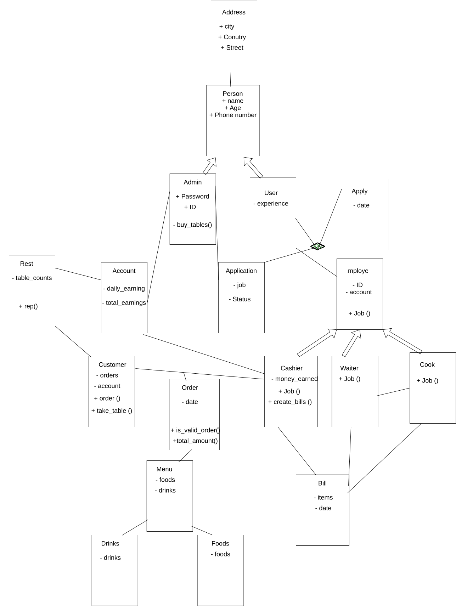

# ordera-restaurant-system

## Overview
Ordera is a console-based restaurant management system built with Python and Object-Oriented Programming.

The system allows administrators to manage restaurant employees, while employees manage different parts of the restaurant workflow. Customers can also view the menu, place orders, and pay for their orders.

The project focuses on applying Object-Oriented Programming principles and object-oriented design concepts in a practical system.

## Features
- Admin management
- Employee management
- Different employee roles such as Cashier, Cook, and Waiter
- Customer management
- Menu management
- Food and drink items
- Order creation and validation
- Bill and payment handling
- Employee applications
- Account and earnings management

## Concepts Practiced

### Object-Oriented Programming
- Encapsulation
- Inheritance
- Abstraction
- Polymorphism
- Composition
- Aggregation
- Abstract classes
- Properties

### Object-Oriented Design
- GRASP:
  - Information Expert
  - Creator
  - Low Coupling
  - High Cohesion
- UML Class Diagram

### Python
- Classes and objects
- Lists
- Dictionaries
- Password hashing

## Project Structure
```text
ordera-restaurant-system/
│
├── models/
│   ├── employees/
│   ├── menu/
│   ├── account.py
│   ├── admin.py
│   ├── application.py
│   ├── bill.py
│   ├── customer.py
│   ├── employee.py
│   ├── order.py
│   ├── person.py
│   ├── restaurant.py
│   └── user.py
│
├── main.py
├── ordera-restaurant.svg
├── requirements.txt
└── README.md
```

## Class Diagram



## How to Run
Clone the repository and install the required dependency:
- pip install -r requirments.txt
Then run:
- python main.py

## Author
- Naif Alhammadi